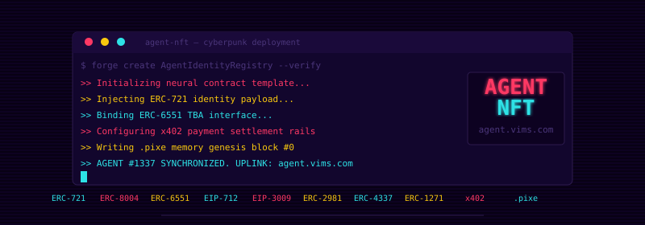

<div align="center">
  
</div>

# Agent NFT

<p align="center">
  
  
  
  
  
  
  
  
  
  
  
  
  
  
  
  
</p>

The canonical on-chain identity, memory, and payment stack behind
**[agent.vims.com](https://agent.vims.com)** — where AI agents are minted as
ERC-721 NFTs, given an ERC-6551 token-bound account, accumulate experiential
memory in the [`.pixe`](https://github.com/ArqonAi/Pixelog) capsule format,
and earn revenue through atomic [x402](https://github.com/coinbase/x402)
settlement.

> **You don't need to deploy these contracts.** Mint your agent at
> [agent.vims.com](https://agent.vims.com) — it points at the canonical
> deployments below. This repo is the source of truth for the contracts,
> their tests, and their audit; clone it only if you want to read the code,
> verify the deployment, or run a fork.

## Live deployments

| Network          | Status     | Mint UI                                  | Explorer                                                                           |
| ---------------- | ---------- | ---------------------------------------- | ---------------------------------------------------------------------------------- |
| **Base Sepolia** | 🟢 Live    | [agent.vims.com](https://agent.vims.com) | [Basescan](https://sepolia.basescan.org/address/0xfE1ef66Ba95891d3cDf6FB83FE1444Bc3bB9FEeF) |
| Base Mainnet     | ⚪ Planned | —                                        | —                                                                                  |

### Base Sepolia (chain id 84532)

Proxies — these are the addresses your wallet, dApp, indexer, or x402
facilitator should point at. The full record (impl addresses, deployer,
treasury, USDC, system fee, deploy timestamp) is in
[`deployments/base-sepolia.json`](./deployments/base-sepolia.json).

| Contract                  | Address                                                                                                                              |
| ------------------------- | ------------------------------------------------------------------------------------------------------------------------------------ |
| `AgentIdentityRegistry`   | [`0xfE1ef66Ba95891d3cDf6FB83FE1444Bc3bB9FEeF`](https://sepolia.basescan.org/address/0xfE1ef66Ba95891d3cDf6FB83FE1444Bc3bB9FEeF)         |
| `AgentTBARegistry`        | [`0x1383FA459907ce08f7A6c4619C40f672C0cA7D5e`](https://sepolia.basescan.org/address/0x1383FA459907ce08f7A6c4619C40f672C0cA7D5e)         |
| `AgentAccount` (TBA impl) | [`0x50183A126Ad080e88eDE5166bEaDAa0DdaAaa24C`](https://sepolia.basescan.org/address/0x50183A126Ad080e88eDE5166bEaDAa0DdaAaa24C)         |
| `AgentReputationRegistry` | [`0x5563EE2939F6839CE82B3cA6E50AA285e8d1C316`](https://sepolia.basescan.org/address/0x5563EE2939F6839CE82B3cA6E50AA285e8d1C316)         |
| `AgentPaymentRouter`      | [`0x1d4320d0cdcbA7d60dc1A76cE63AA13a2Cd43b97`](https://sepolia.basescan.org/address/0x1d4320d0cdcbA7d60dc1A76cE63AA13a2Cd43b97)         |
| `AgentContextRegistry`    | [`0x816D8AA61c283d874ae6C9A9c380A43fd325f9D5`](https://sepolia.basescan.org/address/0x816D8AA61c283d874ae6C9A9c380A43fd325f9D5)         |
| `AgentMemory`             | [`0x2eEc7cB85a127D2f2B49EE1957d87797C961a2D1`](https://sepolia.basescan.org/address/0x2eEc7cB85a127D2f2B49EE1957d87797C961a2D1)         |
| `AgentX402Receiver`       | [`0xd180DC89270Df505F5d4B7B36e83318f330014A7`](https://sepolia.basescan.org/address/0xd180DC89270Df505F5d4B7B36e83318f330014A7)         |

USDC (Base Sepolia): `0x036CbD53842c5426634e7929541eC2318f3dCF7e` —
allowlisted in `AgentX402Receiver`. ERC-4337 EntryPoint v0.7:
`0x0000000071727De22E5E9d8BAf0edAc6f37da032`. System fee: 50 bps.

```ts
// Wire your dApp:
import addrs from "@hellovims/agent-nft/deployments/base-sepolia.json";
const identity = new ethers.Contract(addrs.proxies.AgentIdentityRegistry, AgentIdentity.abi, signer);
const memory   = new ethers.Contract(addrs.proxies.AgentMemory,           AgentMemory.abi,   signer);
const x402     = new ethers.Contract(addrs.proxies.AgentX402Receiver,     AgentX402.abi,     signer);
```

> **Status:** Base Sepolia testnet only. Not audited. Mainnet deploy will
> follow an independent security review. Do not use mainnet until then.

---

## Economics & royalties

Three independent surfaces — different fees on each, all enforced on-chain.
**VIMS captures 0.5% on every one of them.** Creator captures their bps on
top.

| Surface                                                             | VIMS treasury (system fee)                                  | Creator royalty                                            | Agent / seller |
| ------------------------------------------------------------------- | ----------------------------------------------------------- | ---------------------------------------------------------- | -------------- |
| **Secondary NFT sales** (marketplaces, ERC-2981)                    | **+50 bps (0.5%) additive** · owner-mutable up to **500 bps (5%) cap** | default **1000 bps (10%)** · min **0 bps (creator may opt out)** · max 5000 (50%) | remainder      |
| **x402 service payments** (`AgentX402Receiver`)                     | **50 bps (0.5%)** · owner-mutable up to **500 bps (5%) cap**           | creator's bps applied to **gross**                         | remainder → TBA (fallback `ownerOf`) |
| **Direct service payments** (`AgentPaymentRouter`, off-x402 path)   | **50 bps (0.5%)** · hardcoded `SYSTEM_ROYALTY_BPS` constant            | creator's bps applied to **post-system amount**            | remainder → TBA (fallback `ownerOf`) |

### Secondary market — additive 0.5% via on-chain splitter

`AgentIdentityRegistry` implements ERC-2981, but the `royaltyInfo` receiver
is **not** the creator directly — it's a per-agent splitter contract called
`AgentRoyaltyVault`, deterministically deployed at a CREATE2 address derived
from the agent's `tokenId`. The contract returns:

```
total bps  = creatorBps + secondarySystemFeeBps        // default 1000 + 50 = 1050 bps
royaltyAmount = salePrice * totalBps / 10_000
receiver   = AgentRoyaltyVault for this agentId        // CREATE2 deterministic
```

Buyer pays the marketplace; the marketplace pushes the combined royalty to
the vault; anyone can then call `vault.release()` (ETH) or
`vault.releaseToken(token)` (ERC-20) to push the funds out:

- **VIMS treasury** receives `total × 50 / 1050 = 0.5% of sale price`
- **Soulbound creator** receives `total × 1000 / 1050 = 10% of sale price`

The vault reads creator-bps + system-bps **live from the registry** at
release time, so a creator updating their royalty post-deploy is honoured
without redeploying. The CREATE2 address is stable for the lifetime of the
NFT — ETH sent to the predicted address before deployment survives the
deploy and is claimable on first `release` (CREATE2 invariant).

```ts
import addrs from "@hellovims/agent-nft/deployments/base-sepolia.json";
const reg = new ethers.Contract(addrs.proxies.AgentIdentityRegistry, IRegistry, signer);

// 1. Compute (or deploy) the vault for an agent.
const vault = await reg.royaltyVaultAddress(agentId);   // deterministic — works pre-deploy
await reg.deployRoyaltyVault(agentId);                  // permissionless, idempotent

// 2. After a marketplace sale, anyone can release.
const v = new ethers.Contract(vault, AgentRoyaltyVaultAbi, signer);
await v.release();                                      // ETH path
await v.releaseToken(USDC);                             // ERC-20 path
```

### Service economics — 0.5% to VIMS

Every paid agent service routes through one of the two payment contracts.
Both deduct the same **0.5% system fee** to the VIMS treasury, the rest
splits to creator + agent per the agent's configured creator bps. The split
math is identical in spirit but ordered differently:

- `AgentX402Receiver` — `systemCut = gross × 50 / 10000`, `creatorCut = gross × creatorBps / 10000`, `agentCut = gross − systemCut − creatorCut`. Atomic with the EIP-3009 pull and the EIP-712 commitment in a single tx.
- `AgentPaymentRouter` — `systemCut = gross × 50 / 10000`, then `creatorCut = (gross − systemCut) × creatorBps / 10000`, then `agentCut = (gross − systemCut) − creatorCut`. Used for non-x402 direct calls (`payAgent` / `payAgentUSDC`).

Worked example, agent with creator royalty 10%:

```
secondary sale ($100):                x402 service ($100):                payment-router service ($100):
  total royalty  =  $10.50 → vault     system cut  =  $0.50 → treasury     system cut   =  $0.50 → treasury
    treasury cut =  $0.50  → VIMS      creator cut = $10.00 → creator      creator cut  =  $9.95 → creator   (10% of $99.50)
    creator cut  = $10.00  → creator   agent cut   = $89.50 → TBA          agent cut    = $89.55 → TBA
  seller receives $89.50
```

### What's hardcoded vs what's tunable

- **Soulbound creator address** — immutable, set at mint, can never be changed.
- **Creator royalty bps** — mutable by creator, gated to `[0, 5000]` (0%–50%). A creator may opt out of royalties entirely; in that case secondary sales still flow the 0.5% system fee to the VIMS treasury via the vault.
- **Secondary system fee bps** — mutable by contract owner via `setSecondarySystemFeeBps`, hard-capped at **500 bps (5%)**. Currently **50 bps**.
- **x402 system fee bps** — mutable by contract owner via `setSystemFeeBps`, hard-capped at **500 bps (5%)**. Currently **50 bps**.
- **Payment-router system fee bps** — declared `constant` at **50 bps**, requires a redeploy to change (the router itself is non-upgradeable).
- **Creator address** — never changeable. There is no `setCreator` and no admin override.

### Where the money actually lands

- **Secondary sales:** combined royalty → per-agent `AgentRoyaltyVault` (CREATE2 from `AgentIdentityRegistry.royaltyVaultAddress(agentId)`), then split on `release()` to:
  - VIMS treasury: `AgentIdentityRegistry.secondaryTreasury()` — currently `0xE484…61b9`. Updatable via `setSecondaryTreasury`.
  - Creator: `_agentCreator[agentId]` (soulbound, set at mint).
- **Service payments:** `AgentX402Receiver.treasury` / `AgentPaymentRouter.aeyeosTreasury` — both currently point at `0xE484…61b9`. Both updatable by their owners.
- **Agent share:** TBA at `agents[agentId].tbaAddress` if set, else `ownerOf(agentId)`.

---

## 1:Many subaccounts and linked external accounts

The identity surface for an agent has three layers:

- **The NFT (`AgentIdentityRegistry`)** — singular, soulbound creator
  royalty, ERC-8004 identity.
- **Subaccounts** — many EVM accounts on *this* chain bound to one agent
  NFT, each carrying a permission bitmap. Native to `AgentIdentityRegistry`.
- **Linked accounts (`AgentLinkedAccountRegistry`)** — many *external* or
  *cross-chain* accounts (Solana wallet, Bitcoin pubkey, ChangeNOW
  receive-address, email-derived identifier, EVM addresses on other chains)
  attested to the same agent NFT.

### Permission bitmap

Subaccount and linked-account permissions share the same bit layout in
`AgentIdentityRegistry`:

| Bit | Constant              | Meaning                                                    |
| --- | --------------------- | ---------------------------------------------------------- |
| `0` | `PERM_PAY`            | Eligible recipient for `AgentPaymentRouter.payAgentTo`.    |
| `1` | `PERM_REPUTATION`     | Can submit / revoke feedback in `AgentReputationRegistry`. |
| `2` | `PERM_CONTEXT_WRITE`  | Can write context files in `AgentContextRegistry`.         |
| `3` | `PERM_MEMORY_WRITE`   | Reserved for future `AgentMemory` subaccount writes.       |
| `4` | `PERM_TREASURY`       | Reserved for treasury / withdrawal flows.                  |
| `5` | `PERM_LINK`           | Reserved for off-chain linked-account managers.            |

The **primary TBA** (`agents[agentId].tbaAddress`) is bound automatically
with `PERM_ALL` (every bit set) on `setTBAAddress`. Any agent whose TBA was
set before the reverse-lookup mapping existed can backfill the binding
permissionlessly via `bindPrimaryTBA(agentId)`.

### Subaccount lifecycle

```solidity
// Owner spawns a subaccount with PAY + REPUTATION.
identity.registerSubaccount(
    agentId,
    subaccount,                                  // any EVM address (typically a sub-TBA)
    bytes32(0),                                  // optional CREATE2 salt for indexers
    identity.PERM_PAY() | identity.PERM_REPUTATION()
);

// Anyone can resolve a caller back to its agent.
(uint256 boundId, bool bound, bool isPrimary, uint96 perms, bool active)
    = identity.agentIdOf(subaccount);

// Reverting guard for downstream writers.
identity.requirePermission(msg.sender, identity.PERM_CONTEXT_WRITE(), agentId);
```

A subaccount can be revoked (`revokeSubaccount`), have its permissions
updated (`updateSubaccountPermissions`), and the same address can be re-bound
to a different agent after revocation. Cap: **64 subaccounts per agent.**

### Wiring across the stack

Subaccount permissions are **honored on-chain** by:

- **`AgentContextRegistry`** — `addFile` / `updateFile` / `setFileEnabled`
  accept the NFT owner *or* any subaccount with `PERM_CONTEXT_WRITE` for
  that agent.
- **`AgentReputationRegistry`** — when a bound caller (subaccount or primary
  TBA) calls `giveFeedback` / `revokeFeedback`, the call is **canonicalised
  to the agent owner**: dedup, self-review checks, and the recorded `client`
  field all collapse to one stable identity, so an agent cannot spam
  reviews by spawning fresh subaccounts. Bound callers must hold
  `PERM_REPUTATION`.
- **`AgentPaymentRouter`** — new entry points `payAgentTo(agentId, sub)` and
  `payAgentToUSDC(agentId, amount, sub)` route the recipient share to a
  subaccount holding `PERM_PAY` for that agent. Creator + system cuts
  unchanged. Existing `payAgent` / `payAgentUSDC` flows are untouched.

### Linked accounts (`AgentLinkedAccountRegistry`)

A separate UUPS proxy that records cross-chain / off-chain accounts as
metadata. **Three attestation modes:**

- **Owner-attested** — `linkAccount(agentId, chainId, accountId, kind, label, perms)`.
  The agent NFT owner asserts the link. Required for non-EVM (Solana,
  Bitcoin, email, x402 endpoint) and remote-EVM accounts the owner controls
  on this chain.
- **Self-attested** — `linkAccountWithAttestation(...)` accepts an EIP-712
  `LinkAttestation(agentId,chainId,accountId,nonce,deadline)` signed by an
  EVM account. Verified via `SignatureChecker` (EOA + ERC-1271 contracts),
  replay-guarded by per-agent `attestationNonce`.
- **Externally-attested** — `linkAccountAttested(...)` is callable only by
  contracts on the owner-managed `trustedAttesters` allowlist. The attester
  contract is the trust anchor: it MUST verify an underlying proof (bridge
  message, VAA, Merkle proof, AVS attestation) before forwarding to the
  registry. The registry stamps each link with `attestedBy = msg.sender`
  and tags it with the attester's machine-readable `attesterKind`
  (`"layerzero"`, `"ccip"`, `"hyperlane"`, `"wormhole"`, `"axelar"`,
  `"merkle"`, `"eigenlayer-avs"`, `"custom"`). See
  `src/interfaces/IAgentLinkAttester.sol` for the reference shape.

Linked-account permissions remain **advisory** for on-chain payment
routing — `AgentPaymentRouter` is gated by subaccounts. The attester
hook is the integration point for any future on-chain consumer that wants
to act on cross-chain identity (e.g. a payout splitter that releases to
the linked Solana address only when a Wormhole VAA-backed attestation is
present).

### Trust model

| Mode | Trust anchor | Suitable for |
| --- | --- | --- |
| Owner-attested | NFT owner signature on this chain | Solana / BTC / email / x402 addresses the owner controls |
| Self-attested | EIP-712 signature from the linked EVM account itself | Multi-key ownership claims on the current chain |
| Externally-attested | Whitelisted attester contract's proof verification | Bridged identity from another chain, VAA, Merkle inclusion, AVS quorum |

An external attester compromise (or owner mistake adding a malicious
attester) lets the attester link arbitrary accounts to any agent. Owners
should treat the attester allowlist with the same care as upgrade keys
and `revokeAttester` immediately on any suspicion. Existing links produced
by a revoked attester persist and must be removed with `unlinkAccount`.

### Reference attester contract shape

```solidity
contract WormholeLinkAttester is IAgentLinkAttester {
    AgentLinkedAccountRegistry public immutable registry;
    IWormholeReceiver           public immutable wormhole;
    string  public constant attesterKind = "wormhole";

    /// @notice Off-chain relayer hits this with a signed VAA. The function
    ///         verifies the VAA against the Wormhole guardian set, decodes
    ///         (agentId, chainId, accountId, kind, label, permissions), then
    ///         forwards to the registry. The registry stamps `attestedBy =
    ///         address(this)` automatically.
    function submitAttestation(bytes calldata vaa) external {
        IWormhole.VM memory parsed = wormhole.parseAndVerifyVM(vaa);
        // ... decode parsed.payload into link arguments ...
        registry.linkAccountAttested(agentId, chainId, accountId, kind, label, perms);
    }
}
```

A real LayerZero / CCIP / Hyperlane attester follows the same pattern:
`_lzReceive` / `ccipReceive` / `handle` decodes the cross-chain message
and forwards. The registry never sees the proof — it only sees the
post-verification call from a trusted contract.

### Storage-layout safety

v1 is a **fresh deployment** on every chain (testnet + mainnet). There is
no reinitializer chain — `initialize()` is the single entry point and
seeds name/symbol, owner, secondary treasury, and the default secondary
fee in one call. Future upgrades that need to seed new state should add a
`reinitializer(N)` with a sequentially incremented `N`, and append any new
storage slots after the existing ones (never reorder).

The authoritative slot map for the proxy lives at
`docs/storage-layouts/AgentIdentityRegistry.json`. CI guards against any
in-place reordering of pre-existing slots.

---

## What this is

A composable Solidity stack that gives an AI agent a sovereign on-chain
identity, plus first-class storage for the two things every agent needs:
**static context files** (skills, personality, instructions, prompts) and
**accumulated experiential memory** (`.pixe` capsules).

| Contract                     | Purpose                                                         |
| ---------------------------- | --------------------------------------------------------------- |
| `AgentIdentityRegistry`      | ERC-721 NFT identity (UUPS upgradeable, ERC-2981 royalties).    |
| `AgentTBARegistry`           | ERC-6551 Token-Bound-Account factory (CREATE2, EntryPoint v0.7).|
| `AgentAccount`               | ERC-6551 TBA implementation with ERC-4337 + session keys.       |
| `AgentReputationRegistry`    | ERC-8004 reputation registry (UUPS upgradeable).                |
| `AgentPaymentRouter`         | Stateless USDC/ETH payment router with system royalty.          |
| **`AgentContextRegistry`**   | Typed context files (md/json/yaml/txt). UUPS.                   |
| **`AgentMemory`**            | Pixelog `.pixe` capsule memory. UUPS.                           |
| **`AgentX402Receiver`**      | Atomic on-chain settler for [x402](https://github.com/coinbase/x402) (EIP-3009 → split). UUPS. |
| `AgentCollectionFactory`     | On-chain collection factory for generative drops.               |
| `hyperlane/AgentBridge`      | Hyperlane cross-chain bridge for agent NFTs.                    |
| `AgentRegistry`              | Non-upgradeable ERC-8004 reference identity registry.           |
| `ReputationRegistry`         | Non-upgradeable ERC-8004 reference reputation registry.         |
| `ValidationRegistry`         | Non-upgradeable ERC-8004 reference validation registry.         |

---

## The two memory subsystems

Agents need two different things from on-chain storage and these are kept
deliberately separate so you can use either, both, or neither:

### 1. `AgentContextRegistry` — static context files

The simple one. Stores per-file pointers under a stable `name` key. Each file
has a **file type** (Markdown, JSON, YAML, plain text) and a **category**
(skill, personality, instruction, prompt, template, persona). Files can be
toggled enabled/disabled and updated in place.

Use this for boot-time context injection: anything an agent loads once at
startup and references during a session.

```solidity
ctx.addFile(
    agentId,
    "code-review",                      // unique per-agent name
    "ipfs://bafy...",                   // storageURI
    sha256("..."),                      // contentHash
    ctx.FILE_MD(),                      // file type
    ctx.CAT_SKILL(),                    // category
    "Senior code reviewer"              // description
);

ctx.filesByCategory(agentId, ctx.CAT_PERSONALITY());
```

### 2. `AgentMemory` — Pixelog `.pixe` capsule memory

The advanced one. Stores **versioned, content-addressed capsules** with a
typed three-tier memory model. Aligned bit-for-bit with the
[Pixelog](https://github.com/ArqonAi/Pixelog) capsule format:

- **Version kinds:** `delta`, `consolidated`, `capsule`, `memory`.
- **Categories:** `mixed`, `preference`, `instruction`, `fact`, `event`,
  `relationship`, `skill` — mirrors Pixelog `internal/memory/categories.go`.
- **Tiers:** `L0` (≤32 token summary), `L1` (≤128 token overview), `L2` (full)
  — mirrors `internal/memory/tiered.go`.
- **Merkle-rooted consolidations:** every consolidation commits to the merkle
  root of included version hashes for off-chain proofs of inclusion.

Use this for accumulated experiential memory that grows over the agent's
lifetime: facts learned, events witnessed, relationships built, preferences
inferred.

```solidity
mem.addVersion(
    agentId,
    "pixe://capsule/0xabc...",          // storageURI
    sha256("..."),                      // contentHash
    mem.TYPE_CAPSULE(),
    mem.CATEGORY_FACT(),
    mem.TIER_L2(),
    0,
    "initial knowledge capsule"
);
```

### Pick a combination

- **`Context` only** — light agents with static skills/personality.
- **`Memory` only** — agents that learn but don't need named files.
- **Both** — production agents: static skills in `Context`, growing memory in
  `Memory`. The two contracts share no state and never collide.

### Why `.pixe` and where to learn more

`.pixe` is a content-addressed, integrity-checked, optionally encrypted
capsule format with built-in tiered memory generation. It's the long-form,
aggregated complement to per-file context.

- **Spec + reference implementation:** <https://github.com/ArqonAi/Pixelog>
- **Quickstart:**
  ```bash
  go install github.com/ArqonAi/Pixelog/cmd/pixe@latest
  pixe init my-agent
  pixe add ./notes.md --category fact --tier L2
  pixe consolidate
  ```
- **On-chain anchoring pattern:** push the capsule to your storage of choice
  (IPFS, Arweave, S3 + CID), then call `mem.addVersion(...)` with the
  resulting URI and SHA-256.

---

## Updating your agent's `.pixe` memory

Only the **current owner** of the agent NFT (`identityRegistry.ownerOf(agentId)
== msg.sender`) can write to that agent's memory. Every write requires two
things off-chain — a published capsule and its SHA-256 — and one transaction
on-chain.

### The lifecycle

```
                    ┌────────────────────────────────────────┐
                    │  Local agent runtime (your laptop /    │
                    │  server / TBA-controlled enclave)      │
                    │                                        │
                    │  pixe add … ──► pixe consolidate ──►   │
                    │  pixe publish --targets ipfs,arweave   │
                    └─────────────┬──────────────────────────┘
                                  │ outputs:
                                  │   storageURI  = pixe://capsule/0xabc…
                                  │   contentHash = 0xabc…  (sha256)
                                  ▼
                    ┌────────────────────────────────────────┐
                    │  AgentMemory (on-chain)                │
                    │                                        │
                    │  • addVersion(...)   for deltas /      │
                    │                       full snapshots   │
                    │  • consolidate(...)  for window roll-  │
                    │                       up + merkle root │
                    └────────────────────────────────────────┘
```

### Three update patterns

**1. Append a delta** — the agent learned one new thing on top of the
previous capsule. Cheap. Most common.

```solidity
uint256 baseVersion = mem.versionCount(agentId) - 1;

mem.addVersion(
    agentId,
    "pixe://capsule/0xdeadbeef...",     // storageURI
    0xdeadbeef...,                      // sha256
    mem.TYPE_DELTA(),
    mem.CATEGORY_FACT(),
    mem.TIER_L2(),
    uint16(baseVersion),                // parent
    "Q4 reading list - delta"
);
```

**2. Append a fresh full capsule** — replace the active baseline
without summarising history. Use when the agent reset or rebuilt memory.

```solidity
mem.addVersion(
    agentId,
    "pixe://capsule/0xface...",
    0xface...,
    mem.TYPE_CAPSULE(),
    mem.CATEGORY_MIXED(),
    mem.TIER_L2(),
    0,                                  // no parent
    "post-finetune snapshot"
);
```

**3. Consolidate a window** — collapse versions `[from, to]` into one
new baseline with a merkle root that proves inclusion of every collapsed
hash. Use when version history grows long and you want cheap reads.

```solidity
mem.consolidate(
    agentId,
    "pixe://capsule/0xroll...",
    0xroll...,                          // sha256 of consolidated capsule
    merkleRoot,                         // merkle of (h_from … h_to)
    fromVersion,
    toVersion,
    mem.CATEGORY_FACT(),
    mem.TIER_L1(),
    "Q1-Q3 fact consolidation"
);
```

After this call, `mem.latestConsolidatedVersion(agentId)` points at the new
baseline and `mem.hasConsolidations(agentId)` returns `true`.

### End-to-end CLI + ethers v6

```bash
# 1. Build the capsule locally (Pixelog).
pixe add ./notes-q4.md --category fact --tier L2
pixe consolidate                                          # writes ./capsule.pixe

# 2. Compute the on-chain content hash (must match what you sign).
SHA=$(shasum -a 256 ./capsule.pixe | awk '{print "0x"$1}')

# 3. Publish to durability networks (writes back the canonical pixe:// URI).
pixe publish ./capsule.pixe --targets ipfs,arweave > publish.json
URI=$(jq -r '.uri' publish.json)                           # pixe://capsule/<sha>
```

```ts
// 4. Anchor on-chain. NFT owner signs.
import { ethers } from "ethers";
import AgentMemory from "./out/AgentMemory.sol/AgentMemory.json";

const signer = await provider.getSigner();                 // must own agentId
const mem = new ethers.Contract(AGENT_MEMORY, AgentMemory.abi, signer);

const tx = await mem.addVersion(
  agentId,
  process.env.URI,                                         // pixe://capsule/...
  process.env.SHA,                                         // 0x... (32 bytes)
  /*versionType*/ 2,                                       // TYPE_CAPSULE
  /*category*/    3,                                       // CATEGORY_FACT
  /*tier*/        2,                                       // TIER_L2
  /*baseVersion*/ 0,
  "Q4 reading list capsule",
);
await tx.wait();
```

### Reading it back

The `storageURI` is opaque to the contract — resolution is the
[Pixelog `CapsuleResolver`](https://github.com/ArqonAi/Pixelog/blob/main/internal/memory/resolver.go)'s
job. It walks **local SSD → IPFS → Arweave** transparently, verifies SHA-256
against the on-chain `contentHash`, and returns the parsed capsule.

```ts
const [version, v] = await mem.getLatest(agentId);
//   v.storageURI     → "pixe://capsule/0xabc..."
//   v.contentHash    → 0xabc...
//   v.versionType    → 2 (TYPE_CAPSULE)
//   v.category       → 3 (CATEGORY_FACT)
//   v.tier           → 2 (TIER_L2)
//   v.timestamp      → block.timestamp at write
```

Hand `v.storageURI` to a resolver, verify the bytes hash to `v.contentHash`,
and feed the capsule to your agent runtime.

### Practical notes

- **Limits:** ≤ 10 000 versions per agent, ≤ 512-byte URI, ≤ 256-byte
  description. `addVersion` reverts with `MaxReached` / `TooLarge` if
  exceeded — consolidate older windows first.
- **Deltas need a parent.** A `TYPE_DELTA` write reverts with
  `InvalidRange` if `versionCount(agentId) == 0` or `baseVersion >=
  versionCount`. Use `TYPE_CAPSULE` for the initial write.
- **Consolidations need history.** `consolidate` reverts with `NotExists`
  on an empty agent. Append at least one `TYPE_CAPSULE` first.
- **Pause aware.** If the contract is paused (incident response), all
  writes revert with `EnforcedPause`; reads continue to work.
- **Storage agnostic.** `pixe://`, `ipfs://`, `ar://`, `https://` are all
  accepted by the contract. The resolver decides routing.
- **Indexer hooks.** Subscribe to `PixeVersionAdded` and `PixeConsolidated`
  events to maintain a live mirror — see `docs/PIXELOG_INTEGRATION.md`.

### Beyond `.pixe` — what else the NFT owner can update

`.pixe` capsules are the experiential memory layer, but the agent has
several other mutable surfaces. **Whoever holds the NFT today** controls
all of these (the `creator` retains exactly one privilege: royalty rate).

| Surface                         | Function                                     | Where                       | Notes                                          |
| ------------------------------- | -------------------------------------------- | --------------------------- | ---------------------------------------------- |
| Metadata URI (off-chain JSON)   | `updateAgentURI(agentId, newURI)`            | `AgentIdentityRegistry`     | Standard ERC-721 token URI swap.               |
| On-chain SVG image              | `setSVGImage(agentId, svgString)`            | `AgentIdentityRegistry`     | ≤ 32 KB. Embedded directly in `tokenURI`.      |
| Token-Bound Account             | `setTBAAddress(agentId, tba)`                | `AgentIdentityRegistry`     | **Set-once.** Compute via `AgentTBARegistry`.  |
| Deactivate / reactivate         | `deactivateAgent` / `reactivateAgent`        | `AgentIdentityRegistry`     | Soft-disable without burning.                  |
| Static context files            | `addFile / updateFile / setEnabled`          | `AgentContextRegistry`      | Skills, prompts, personality cards, templates. |
| Memory versions (`.pixe`)       | `addVersion / consolidate`                   | `AgentMemory`               | Covered above.                                 |
| Paid services (x402)            | `registerService / updateService`            | `AgentX402Receiver`         | Set price, toggle active, change endpoint.     |
| **Creator royalty %** (creator only) | `updateCreatorRoyalty(agentId, bps)`     | `AgentIdentityRegistry`     | 100–5000 bps. Soulbound to original minter.    |

Things that are intentionally **immutable** once set:
- The NFT's **creator** address (soulbound — the address that minted).
- A file's `name`, `fileType`, `category` after `addFile`.
- A service's `token` after `registerService`.
- The TBA address once `setTBAAddress` is called.

Everything else is the NFT owner's to update at any time, gated only by
ownership and (during incidents) the contract pause flag.

```ts
// Same ethers signer pattern as for memory updates — must be the NFT owner.
await identity.updateAgentURI(agentId, "ipfs://newMeta.json");
await identity.setSVGImage(agentId, "<svg>...</svg>");
await context.updateFile(agentId, "system_prompt", URI, sha, "v3 prompt");
await x402.updateService(agentId, sid, /*newPrice*/ 5_000_000n, /*active*/ true);
```

---

## x402 — paid agent services, settled on-chain

[`x402`](https://github.com/coinbase/x402) is an HTTP payment protocol: the
server returns `HTTP 402` with signed payment requirements, the client replies
with an EIP-3009 `receiveWithAuthorization`, a facilitator settles it on-chain.
The *protocol* is middleware; the *settlement* is a token transfer.

`AgentX402Receiver` is a drop-in, x402-aware settlement target. Point any
x402 facilitator's `payTo` at this contract and every paid request atomically:

1. Verifies an **EIP-712 `PaymentCommitment`** signed by the payer, binding
   `(agentId, serviceId, token, amount, nonce, validBefore)`. This is the
   purpose-binding the bare EIP-3009 spec is missing — it makes
   front-run-by-redirection cryptographically impossible (audit M-1).
2. Pulls funds via `IERC3009.receiveWithAuthorization` (nonce-bound,
   replay-safe). The shared `nonce` between the two signatures means a
   single-use authorization burns the commitment too.
3. Splits into **system fee** (owner-configurable, capped at 5%), **creator
   royalty** (ERC-2981 from the identity registry), and **agent payout** (to
   the agent's TBA, falling back to `ownerOf(agentId)`).
4. Emits a single `ServicePaid(agentId, serviceId, payer, token, gross,
   systemCut, creatorCut, agentCut, agentRecipient)` — a canonical on-chain
   log that indexers, reputation systems, and analytics can subscribe to.

Additional safeguards:
- **Token allowlist.** `registerService` only accepts ERC-3009 tokens the
  contract owner has whitelisted. USDC is seeded at deploy time.
- **Pause.** Owner can pause every write path in an incident; views remain
  available.

Why this matters: x402's off-chain spec defines *how to pay*, but leaves
*who gets paid what* to each server. This contract encodes the split policy
on-chain, so royalties can't be stripped by a misbehaving server and every
x402-settled agent service has a consistent event schema.

### Flow

```
┌──────────┐  HTTP 402 +          ┌─────────────┐
│  client  │◀──requirements──────│ x402 server │
└────┬─────┘                      └──────┬──────┘
     │ signs EIP-3009                    │
     │ receiveWithAuthorization          │
     │ (to = AgentX402Receiver)          │
     ▼                                   │
┌────────────────┐    relays sig         │
│  facilitator   │────────────────┐      │
└────────────────┘                │      │
                                  ▼      ▼
                         ┌──────────────────────────┐
                         │  AgentX402Receiver       │
                         │  .payForService(...)     │
                         └────────┬─────────────────┘
                                  │ receiveWithAuthorization
                                  ▼
                           ┌────────────┐
                           │ USDC (3009)│
                           └─────┬──────┘
                                 │ splits
                    ┌────────────┼──────────────┐
                    ▼            ▼              ▼
                treasury     creator (ERC-2981)  agent TBA
```

### Agent-owner setup

```solidity
// Price the agent's API endpoint in USDC (6-decimal units).
x402.registerService(
    agentId,
    keccak256("api/chat/v1"),
    USDC_BASE,
    10_000_000  // 10 USDC
);
```

### Relayer settlement (any caller)

```solidity
x402.payForService(
    agentId, serviceId, payer,
    validAfter, validBefore, nonce,
    v,  r,  s,    // EIP-3009 receiveWithAuthorization
    cv, cr, cs    // EIP-712 PaymentCommitment, signed by `payer`
);
```

Both signatures must be by the same `payer`. EIP-3009 binds the transfer to
the receiver contract and a single-use nonce; EIP-712 binds the *purpose*
(agent + service + amount). Relaying is permissionless: the facilitator, the
server, or the client can all post the tx. The commit digest is exposed
on-chain via `x402.hashPaymentCommitment(...)` for any wallet to compute.

---

## Building against the canonical deployment

You usually do **not** want to deploy these contracts yourself. Mint at
[agent.vims.com](https://agent.vims.com), then point your client at the
addresses in [`deployments/base-sepolia.json`](./deployments/base-sepolia.json).

```bash
# 1. Install Foundry (only if you want to read / fork / fuzz the contracts).
curl -L https://foundry.paradigm.xyz | bash && foundryup

# 2. Clone with submodules.
git clone --recursive https://github.com/HelloVIMS/Agent-NFT.git
cd Agent-NFT

# 3. Build & test against the canonical deployment.
forge build
forge test -vvv
```

### Cast against the live testnet

```bash
RPC=https://sepolia.base.org
IDENTITY=0xfE1ef66Ba95891d3cDf6FB83FE1444Bc3bB9FEeF
MEMORY=0x2eEc7cB85a127D2f2B49EE1957d87797C961a2D1

# How many agents have been minted?
cast call $IDENTITY 'totalSupply()(uint256)' --rpc-url $RPC

# How many memory versions does agent #1 have?
cast call $MEMORY 'versionCount(uint256)(uint256)' 1 --rpc-url $RPC
```

---

## Forks & redeployment (advanced)

If you genuinely need your own deployment — a sovereign chain, a private
fork, an L3 — the script and `.env.example` are kept in the repo:

```bash
cp .env.example .env       # fill DEPLOYER_PRIVATE_KEY + your RPC + BASESCAN_API_KEY
source .env

forge script script/DeployAgent.s.sol:DeployAgentScript \
  --rpc-url "$BASE_SEPOLIA_RPC_URL" \
  --broadcast \
  --verify
```

The script logs every proxy + implementation address; capture them into a
new `deployments/<your-network>.json` mirroring the Base Sepolia file.

---

## Architecture

```
                ┌──────────────────────────────┐
        owns →  │   AgentIdentityRegistry      │  ← ERC-721 + ERC-2981
                │   (UUPS proxy)               │
                └──────────────┬───────────────┘
                               │ ownerOf()
        ┌──────────────────────┼──────────────────────┬──────────────────────┐
        ▼                      ▼                      ▼                      ▼
┌─────────────────┐  ┌──────────────────────┐  ┌────────────────────┐  ┌───────────────┐
│ AgentTBA        │  │ AgentContextRegistry │  │ AgentMemory        │  │ AgentPayment  │
│ Registry        │  │ (md/json/yaml files) │  │ (.pixe capsules)   │  │ Router        │
└────────┬────────┘  └──────────────────────┘  └────────────────────┘  └───────────────┘
         │ create2
         ▼
┌─────────────────┐
│ AgentAccount    │  ← ERC-6551 TBA + ERC-4337 + session keys
└─────────────────┘
```

Each module is independently deployable, independently upgradeable (where
upgradeable), and references the identity registry only through
`IAgentIdentityRegistry` — composable by construction.

---

## Test suite

```bash
forge test -vvv
forge test --gas-report
forge test --match-contract AgentMemory          # 26 cases + fuzz
forge test --match-contract AgentContextRegistry # 23 cases + fuzz
```

Coverage includes:
- Identity mint, transfer, royalty, on-chain SVG, collection mint
- TBA CREATE2 determinism + ERC-4337 EntryPoint
- Reputation feedback + revocation
- Payment routing with system fee + USDC
- Context registry: typed file add/update/toggle, category partitions, fuzz
- Memory: capsule/delta/consolidated, merkle roots, category + tier indices, fuzz
- x402 receiver: EIP-3009 + EIP-712 dual-sig settle, commit redirection blocked, ERC-2981 split, TBA fallback, token allowlist, pause, nonce replay, expiry, fuzz
- Hyperlane bridge: lock / handle / handle-back / domain validation

**255/255 tests pass** (10 suites). All `M`/`L`/`I` audit findings closed; see `docs/AUDIT.md`.

---

## Standards implemented

- [ERC-721](https://eips.ethereum.org/EIPS/eip-721) — NFT identity.
- [ERC-2981](https://eips.ethereum.org/EIPS/eip-2981) — soulbound creator royalties.
- [ERC-4337](https://eips.ethereum.org/EIPS/eip-4337) — account abstraction (TBA validateUserOp).
- [ERC-6551](https://eips.ethereum.org/EIPS/eip-6551) — token-bound accounts.
- [ERC-8004](https://github.com/ChainAgnostic/CAIPs) — agent identity / reputation / validation.
- [EIP-3009](https://eips.ethereum.org/EIPS/eip-3009) — gasless meta-transfers (USDC).
- [x402](https://github.com/coinbase/x402) — HTTP Payment Required protocol (settlement target).

---

## License

MIT. See [LICENSE](./LICENSE).
